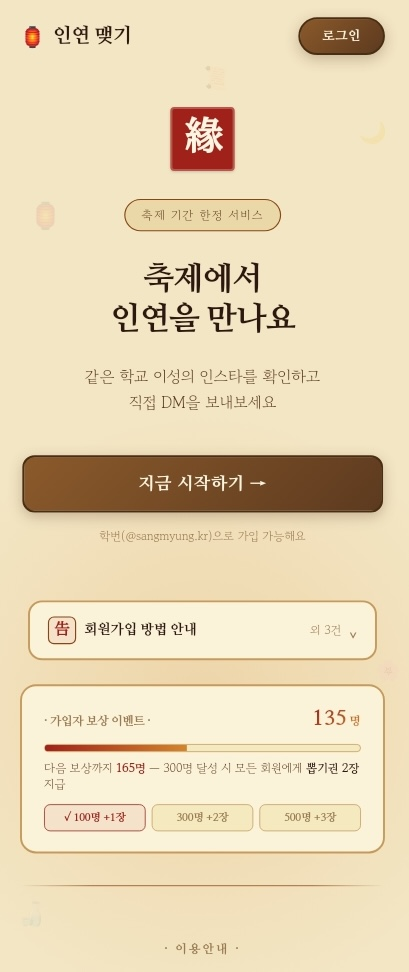
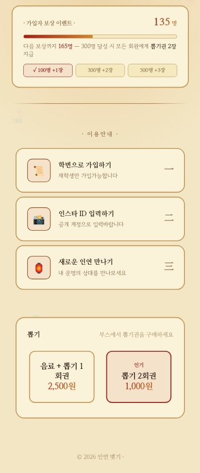
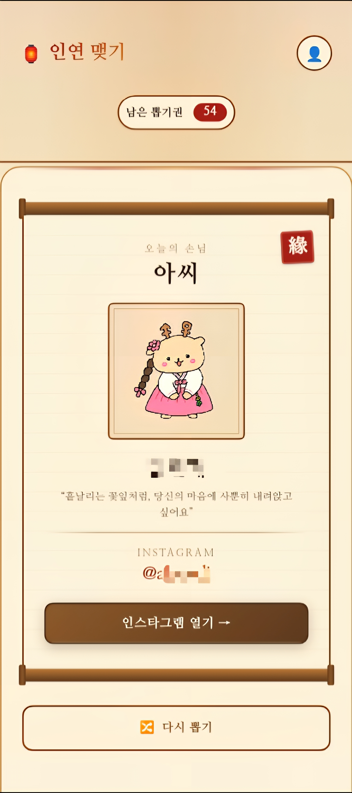
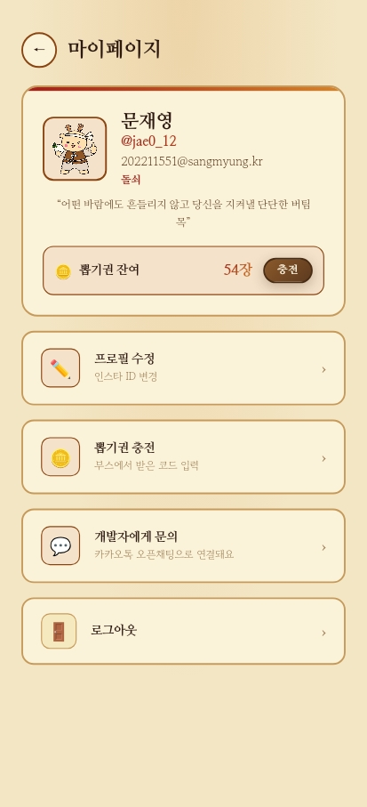
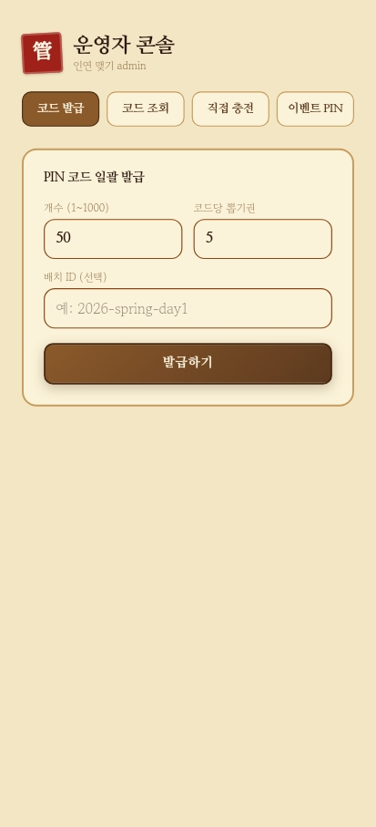

# 인연 맺기 (smu-signal)

2026 상명대학교 서울캠퍼스 대동제 [VOYAGE : Our Route] 컴퓨터과학전공 부스에서 운영한 **축제 한정 매칭 서비스**.<br/>
사용자가 뽑기권을 소진하며 이성 회원의 프로필을 한 명씩 공개받고, 마음에 들면 노출된 인스타그램 ID로 직접 연락하는 서비스

https://www.smu-signal.com/<br/>https://festival-cc-match.vercel.app/<br/>

축제 부스에서 현장 결제 → 회원가입/로그인 → 웹앱에서 뽑기권 코드 입력 → 뽑기권 충전 → 매칭의 전 과정을 처리한다.

> **운영 기간**: 2026-05-21 ~ 2026-05-22 (상명대 축제)

---

## 주요 기능

- **이메일 OTP 가입** — 학번(`@sangmyung.kr`) 입력 → Supabase Auth Confirm Sign Up → 8자리 코드 확인 → 프로필 작성.
- **뽑기 + 다시뽑기(reroll)** — 뽑기권을 1장씩 차감하며 이성 프로필 카드 공개. 캐릭터 선호 필터 지원. 한 번 본 카드는 `seen_users`로 추적되어 재노출 안 됨.
- **현장 결제 → PIN 충전** — 운영자가 발급한 1회용 PIN을 사용자가 앱에서 입력해 뽑기권 충전.
- **운영자 어드민** — `profiles.is_admin = true` 인 유저만 접근 가능한 PIN 발급/잔액 관리하는 관리자용 화면.
- **사전가입 기획** — `EVENT_START_AT` 이전엔 가입/프로필 작성만 허용, 피드/충전은 차단 (proxy + API 양쪽에서 검증).
- **가입자 마일스톤 보상** — 누적 가입 인원을 가시성있게 전달하여 목표 인원 도달 시 전 회원에게 뽑기권 자동 적립을 통한 유저 수 확보 전략.

---

## 화면
<p align="center">
  
  
<p/>
<p align="center">
  
  
  
</p>

---

## 기술 스택

| 영역      | 사용 기술                                                        |
| --------- | ---------------------------------------------------------------- |
| Framework | Next.js 16 (App Router)                                          |
| UI        | React 19, Tailwind CSS, shadcn/ui, lucide-react                  |
| Auth / DB | Supabase Auth (Confirm Sign Up + password) + PostgreSQL with RLS |
| Email     | Custom SMTP via Resend (도메인 DKIM/SPF 검증 완료)               |
| Hosting   | Vercel (cron 포함)                                               |
| Domain    | smu-signal.com (Vercel + DNS)                                    |

---

## 아키텍처

### 1. 매직 링크 → Confirm Sign Up + OTP 전환

초기엔 Supabase `signInWithOtp` (매직 링크 + 토큰) 방식이었으나, **모바일에서 메일 앱이 다른 브라우저를 띄우면 쿠키가 분리돼 신규 유저 안내 루프**에 빠지는 문제가 발생.
→ `signUp({ email, password })` + 8자리 토큰을 입력받는 방식으로 전환. 사용자가 어떤 디바이스/브라우저에서 메일을 보든 코드만 알면 가입이 완료됨.

### 2. Row Level Security 우회 패턴

`profiles` 테이블은 `auth.uid() = id` 로만 SELECT 가능하도록 RLS가 걸려 있어, **피드용 카드 조회는 service_role 클라이언트로 우회**.
인증/인가는 라우트 진입 시점에 anon 키 + 쿠키로 검증한 뒤, 데이터 조회만 `createServiceClient()` 로 처리하는 이중 패턴.
참고: [app/api/feed/next/route.ts](app/api/feed/next/route.ts), [lib/feed.ts](lib/feed.ts)

### 3. 본 행사 게이트의 이중 방어

proxy (Edge runtime) 와 각 API 라우트 양쪽에서 `isEventOpen()` 검사. 클라이언트 우회 시도가 있어도 API 단에서 막혀 게이트가 무력화되지 않음.
참고: [lib/eventGate.ts](lib/eventGate.ts), [proxy.ts](proxy.ts)

### 4. DB 마이그레이션 미적용 케이스 fallback

일부 라우트는 `PGRST204`(누락 컬럼) 발생 시 해당 컬럼만 제거 후 재시도해서 신규 환경에서도 핵심 기능이 동작하도록 처리.
참고: [app/api/user/profile/route.ts](app/api/user/profile/route.ts), [app/api/admin/codes/shared/route.ts](app/api/admin/codes/shared/route.ts)

### 5. 충전 코드 사용 트랜잭션

1회용 코드는 `redemption_codes.used_by` 갱신, 공유 코드는 `redemption_code_uses` insert. 잔액 증가 RPC 실패 시 **보상 트랜잭션**으로 코드 사용 흔적을 롤백.
참고: [app/api/redeem/route.ts](app/api/redeem/route.ts)

---

## 디렉터리 구조

```
app/
├── api/
│   ├── admin/         # PIN 발급, 잔액 부여 (admin only)
│   ├── auth/          # 학교이메일 check-user, send-code (resend)
│   ├── cron/          # 미완성 가입자 정기 정리
│   ├── feed/          # 유저 인스타 카드 next, reroll
│   ├── redeem/        # 코드 충전
│   ├── stats/         # 가입자 카운터
│   └── user/          # me, profile, balance, delete
├── auth/              # signup, verify, profile, callback
├── feed/              # 카드 뽑기 UI
├── mypage/            # 프로필 / 잔액 / 충전 진입
├── redeem/            # PIN 입력
├── admin/             # 어드민 대시보드
└── page.tsx           # 랜딩 (카운트다운 + 가입자 카운터 + 공지)

lib/
├── eventGate.ts       # 본 행사 게이트 (KST 기준)
├── feed.ts            # 다음 후보 선정 (캐릭터 선호 + seen 필터)
├── characters.ts      # 캐릭터 메타데이터
├── admin.ts           # 권한 체크 + PIN 생성
└── supabase/          # client / server / service factories

proxy.ts               # 인증/게이트 미들웨어
```

---

## 로컬 실행

```bash
# 1. 환경변수 준비
cp .env.example .env.local
# 그리고 .env.local 에 Supabase URL/키 채우기

# 2. 의존성 설치
pnpm install   # 또는 npm / yarn / bun

# 3. 개발 서버
pnpm dev
# → http://localhost:3000
```

> **참고**: Supabase 프로젝트가 필요합니다. 별도 DB 마이그레이션 스크립트는 정리 중이며, 핵심 테이블은 다음과 같습니다: `profiles`, `reroll_balance`, `seen_users`, `redemption_codes`, `redemption_code_uses`.

---

## 라이선스

본 프로젝트는 학내 행사 운영을 목적으로 제작되어 별도 라이선스를 명시하지 않습니다. 코드 참조 시 출처를 남겨주세요.
